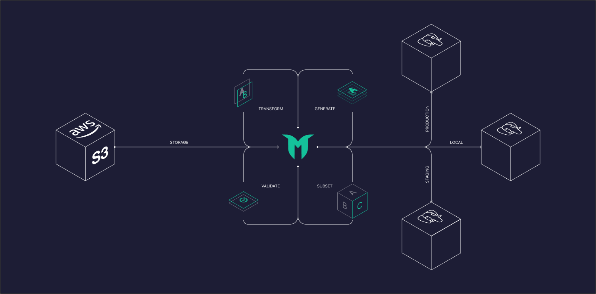

# [Greenmask](https://greenmask.io)

## Dump anonymization and synthetic data generation tool

**Greenmask** is a powerful open-source utility that is designed for logical database backup dumping,
anonymization, synthetic data generation and restoration. It is stateless and does not require any changes to your database schema.

Greenmask Supports:

* PostgreSQL
* [MySQL is in progress](https://github.com/GreenmaskIO/greenmask/issues/222)

[](https://discord.com/invite/rKBKvDECfd)
[](https://t.me/greenmask_ru)
[](https://twitter.com/GreenmaskIO)

[](https://docs.greenmask.io)
[](https://github.com/greenmaskio/greenmask/blob/main/LICENSE)
[](https://github.com/greenmaskio/greenmask/releases/latest)
[](https://somsubhra.github.io/github-release-stats/?username=greenmaskio&repository=greenmask&page=1&per_page=5)
[](https://hub.docker.com/r/greenmask/greenmask)
[](https://goreportcard.com/report/github.com/greenmaskio/greenmask)



## Testing sponsor 💚

<a href="https://www.testmuai.com/?utm_medium=sponsor&utm_source=greenmask" target="_blank">
    
</a>

### Powered by
[](https://jb.gg/OpenSource)

## Getting started

Greenmask has a [Playground](https://docs.greenmask.io/latest/playground/) - it is a sandbox environment in Docker with
sample databases included to help you try Greenmask without any additional actions

1. Clone the `greenmask` repository and navigate to its directory by running the following commands:

    ```shell
    git clone git@github.com:GreenmaskIO/greenmask.git && cd greenmask
    ```

2. Once you have cloned the repository, start the environment by running Docker Compose:

    ```shell
    docker-compose run greenmask
    ```

## Features

* **[Database subset](https://docs.greenmask.io/latest/database_subset/)** - One of the most advanced subset systems 
  on the market. It supports **virtual references**, nullable columns, polymorphic references, and can subset even the 
  most complex schemas with **cyclic references**.
* **[Deterministic transformers](https://docs.greenmask.io/latest/built_in_transformers/transformation_engines/#hash-engine)** — Uses hash functions to ensure consistent output for the same input. Most transformers support both `random` and
  `hash` engines, offering flexibility for various use cases.
* **[Dynamic parameters](https://docs.greenmask.io/latest/built_in_transformers/dynamic_parameters/)** — most
  transformers support dynamic parameters, allowing them to adapt based on table column values. This feature helps
  manage dependencies between columns and meet constraints effectively.
* **[Transformation Condition](https://docs.greenmask.io/latest/built_in_transformers/transformation_condition/)** —
  applies the transformation only when a specified condition is met, making it useful for targeting specific rows.
* **[Transformation validation and easy maintenance](https://docs.greenmask.io/latest/commands/validate/)** — Greenmask
  provides validation warnings, data transformation diffs, and schema diffs during configuration, enabling effective
  monitoring and maintenance of transformations. The schema diff feature helps prevent data leakage when the schema
  changes.
* **[Transformation inheritance](https://docs.greenmask.io/latest/built_in_transformers/transformation_inheritance/)**
  — transformation inheritance for partitioned tables and tables with foreign keys. Define once and apply to all.
* **Stateless** — Greenmask operates as a logical dump and does not impact your existing database schema.
* **Cross-platform** — Can be easily built and executed on any platform, thanks to its Go-based architecture,
  which eliminates platform dependencies.
* **Database type safe** — Ensures data integrity by validating data and using the database driver for encoding and
  decoding operations, preserving accurate data formats.
* **Backward compatible** — Fully supports the same features and protocols as standard Datutilities. Dumps
  created by Greenmask can be seamlessly restored using the `pg_restore` utility.
* **Extensible** — Users have the flexibility
  to [implement domain-based transformations](https://docs.greenmask.io/latest/built_in_transformers/standard_transformers/cmd/)
  in any programming language or
  use [predefined templates](https://docs.greenmask.io/latest/built_in_transformers/advanced_transformers/).
* **Parallel execution** — Enables parallel dumping and restoration to significantly speed up results.
* **Variety of storages** — Supports both local and remote storage, including directories and S3-compatible solutions.
* **[Pgzip support for faster compression](https://docs.greenmask.io/latest/commands/dump/?h=pgzip#pgzip-compression)** — Speeds up dump and restoration processes with parallel compression 
  by setting `--pgzip`.

## Use Cases

Greenmask is ideal for various scenarios, including:

* **Backup and Restoration**. Use Greenmask for your daily routines involving logical backup dumping and restoration. It
  seamlessly handles tasks like table restoration after truncation. Its functionality closely mirrors that of pg_dump
  and pg_restore, making it a straightforward replacement.
* **Anonymization, Transformation, and Data Masking**. Employ Greenmask for anonymizing, transforming, and masking
  backups, especially when setting up a staging environment or for analytical purposes. It simplifies the deployment of
  a pre-production environment with consistently anonymized data, facilitating faster time-to-market in the development
  lifecycle.

### General Information

The best approach for logical backup dumping and restoration is to use core PostgreSQL utilities, specifically pg_dump
and pg_restore. Greenmask is designed to align with these native tools, ensuring full compatibility. It independently
manages data dumping while delegating schema dumping and restoration to `pg_dump` and `pg_restore`, ensuring smooth
integration with PostgreSQL’s standard workflow.

Greenmask utilizes the directory format of `pg_dump` and `pg_restore`, ideal for parallel execution and partial restoration.
This format includes metadata files to guide backup and restoration steps.

#### Storage Options

* **[s3](https://docs.greenmask.io/latest/configuration/#__tabbed_1_2)** - Supports any S3-compatible storage system,
  including AWS S3, offering flexibility across different cloud storage solutions.
* **[directory](https://docs.greenmask.io/latest/configuration/#__tabbed_1_1)** - This is the default option,
  representing a standard filesystem directory for local storage.

#### Data Anonymization and Validation

Greenmask works with **COPY lines**, collects schema metadata using the Golang driver, and employs this driver in the
encoding and decoding process. The **validate command** offers a way to assess the impact on both schema
(**validation warnings**) and data (**transformation and displaying differences**). This command allows you to validate
the schema and data transformations, ensuring the desired outcomes during the Anonymization process.

#### Customization

If your table schema relies on functional dependencies between columns, you can address this challenge using the
[Dynamic parameters](https://docs.greenmask.io/latest/built_in_transformers/dynamic_parameters/). By setting dynamic
parameters, you can resolve such as created_at and updated_at cases, where the
updated_at must be greater or equal than the created_at.

If you need to implement custom logic imperatively
use [Cmd](https://docs.greenmask.io/latest/built_in_transformers/standard_transformers/cmd/) or
[TemplateRecord](https://docs.greenmask.io/latest/built_in_transformers/advanced_transformers/template_record/) or
[Template](https://docs.greenmask.io/latest/built_in_transformers/advanced_transformers/template/) transformers.

#### PostgreSQL Version Compatibility

**Greenmask** is compatible with PostgreSQL versions **11 and higher**.

## Links

* [Documentation](https://docs.greenmask.io)
* Email: **support@greenmask.io**
* [Twitter](https://twitter.com/GreenmaskIO)
* [Discord](https://discord.com/invite/rKBKvDECfd)
* [Telegram [RU]](https://t.me/greenmask_ru)
* [DockerHub](https://hub.docker.com/r/greenmask/greenmask)

## References

* Utilized the  [Demo database](https://postgrespro.com/community/demodb), provided by PostgresPro, for integration
  testing purposes.
* Employed the [adventureworks database](https://github.com/morenoh149/postgresDBSamples) created
  by `morenoh149/postgresDBSamples`, in the Docker Compose playground.
