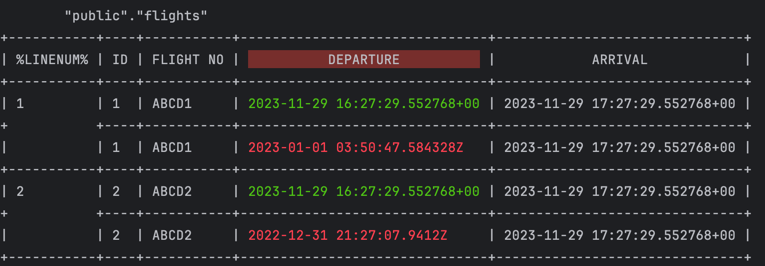

# Commands

## Introduction

```shell title="Greenmask available commands"
greenmask \
  --log-format=[json|text] \
  --log-level=[debug|info|error] \
  --config=config.yml \
  [dump|list-dumps|delete|list-transformers|show-transformer|restore|show-dump]`
```

You can use the following commands within Greenmask:

* `dump` — initiates the data dumping process
* `list-dumps` — lists all available dumps stored in the system
* `delete` — deletes a specific dump from the storage
* `list-transformers` — displays a list of available transformers along with their documentation
* `show-transformer` — displays information about the specified transformer
* `restore` — restores data to the target database either by specifying a `dumpId` or using the latest available dump
* `show-dump` — provides metadata information about a particular dump, offering insights into its structure and
  attributes

For any of the commands mentioned above, you can include the following common flags:

* `--log-format` — specifies the desired format for log output, which can be either `json` or `text`. This parameter is
  optional, with the default format set to `text`.
* `--log-level` — sets the desired level for log output, which can be one of `debug`, `info`, or `error`. This parameter
  is optional, with the default log level being `info`.
* `--config` — requires the specification of a configuration file in YAML format. This configuration file is mandatory
  for Greenmask to operate correctly.
* `--help` — displays comprehensive help information for Greenmask, providing guidance on its usage and available
  commands.

## validate

The `validate` command allows you to perform a validation procedure and compare data transformations.

Below is a list of all supported flags for the `validate` command:

```text title="Supported flags"
Usage:
  greenmask validate [flags]

Flags:
      --data                  Perform test dump for --rows-limit rows and print it pretty
      --diff                  Find difference between original and transformed data
      --format string         Format of output. possible values [text|json] (default "text")
      --rows-limit uint       Check tables dump only for specific tables (default 10)
      --schema                Make a schema diff between previous dump and the current state
      --table strings         Check tables dump only for specific tables
      --table-format string   Format of table output (only for --format=text). Possible values [vertical|horizontal] (default "vertical")
      --transformed-only      Print only transformed column and primary key
      --warnings              Print warnings
```

Validate command can exit with non-zero code when:

* Any error occurred
* Validate was called with `--warings` flag and there are warnings
* Validate was called with `--schema` flag and there are schema differences

All of those cases may be used for CI/CD pipelines to stop the process when something went wrong. This is especially
useful when `--schema` flag is used - this allows to avoid data leakage when schema changed.

You can use the `--table` flag multiple times to specify the tables you want to check. Tables can be written with
or without schema names (e. g., `public.table_name` or `table_name`). If you specify multiple tables from different
schemas, an error will be thrown.

To start validation, use the following command:

```shell
greenmask --config=config.yml validate \
  --warnings \
  --data \
  --diff \
  --schema \
  --format=text \
  --table-format=vertical \
  --transformed-only \
  --rows-limit=1
```

```text title="Validation output example"
2024-03-15T19:46:12+02:00 WRN ValidationWarning={"hash":"aa808fb574a1359c6606e464833feceb","meta":{"ColumnName":"birthdate","ConstraintDef":"CHECK (birthdate \u003e= '1930-01-01'::date AND birthdate \u003c= (now() - '18 years'::interval))","ConstraintName":"humanresources","ConstraintSchema":"humanresources","ConstraintType":"Check","ParameterName":"column","SchemaName":"humanresources","TableName":"employee","TransformerName":"NoiseDate"},"msg":"possible constraint violation: column has Check constraint","severity":"warning"}
```

The validation output will provide detailed information about potential constraint violations and schema issues. Each
line contains nested JSON data under the `ValidationWarning` key, offering insights into the affected part of the
configuration and potential constraint violations.

```json title="Pretty formatted validation warning"
{ 
  "hash": "aa808fb574a1359c6606e464833feceb", // (13)
  "meta": { // (1)
    "ColumnName": "birthdate", // (2)
    "ConstraintDef": "CHECK (birthdate >= '1930-01-01'::date AND birthdate <= (now() - '18 years'::interval))", // (3)
    "ConstraintName": "humanresources", // (4)
    "ConstraintSchema": "humanresources", // (5)
    "ConstraintType": "Check", // (6)
    "ParameterName": "column", // (7)
    "SchemaName": "humanresources", // (8)
    "TableName": "employee", // (9)
    "TransformerName": "NoiseDate" // (10)
  },
  "msg": "possible constraint violation: column has Check constraint", // (11)
  "severity": "warning" // (12)
}
```
{ .annotate }

1. **Detailed metadata**. The validation output provides comprehensive metadata to pinpoint the source of problems.
2. **Column name** indicates the name of the affected column.
3. **Constraint definition** specifies the definition of the constraint that may be violated.
4. **Constraint name** identifies the name of the constraint that is potentially violated.
5. **Constraint schema name** indicates the schema in which the constraint is defined.
6. **Type of constraint** represents the type of constraint and can be one of the following:
   ```
   * ForeignKey
   * Check
   * NotNull
   * PrimaryKey
   * PrimaryKeyReferences
   * Unique
   * Length
   * Exclusion
   * TriggerConstraint
   ```
7. **Table schema name** specifies the schema name of the affected table.
8. **Table name** identifies the name of the table where the problem occurs.
9. **Transformer name** indicates the name of the transformer responsible for the transformation.
10. **Name of affected parameter** typically, this is the name of the column parameter that is relevant to the
    validation warning.
11. **Validation warning description** provides a detailed description of the validation warning and the reason behind
    it.
12. **Severity of validation warning** indicates the severity level of the validation warning and can be one of the
    following:
    ```
    * error
  	* warning
  	* info
  	* debug
    ```
13. **Hash** is a unique identifier of the validation warning. It is used to resolve the warning in the config file

!!! note

    A validation warning with a severity level of `"error"` is considered critical and must be addressed before the dump operation can proceed. Failure to resolve such warnings will prevent the dump operation from being executed.

```text title="Schema diff changed output example"
2024-03-15T19:46:12+02:00 WRN Database schema has been changed Hint="Check schema changes before making new dump" PreviousDumpId=1710520855501
2024-03-15T19:46:12+02:00 WRN Column renamed Event=ColumnRenamed Signature={"CurrentColumnName":"id1","PreviousColumnName":"id","TableName":"test","TableSchema":"public"}
2024-03-15T19:46:12+02:00 WRN Column type changed Event=ColumnTypeChanged Signature={"ColumnName":"id","CurrentColumnType":"bigint","CurrentColumnTypeOid":"20","PreviousColumnType":"integer","PreviousColumnTypeOid":"23","TableName":"test","TableSchema":"public"}
2024-03-15T19:46:12+02:00 WRN Column created Event=ColumnCreated Signature={"ColumnName":"name","ColumnType":"text","TableName":"test","TableSchema":"public"}
2024-03-15T19:46:12+02:00 WRN Table created Event=TableCreated Signature={"SchemaName":"public","TableName":"test1","TableOid":"20563"}
```

Example of validation diff:



The validation diff is presented in a neatly formatted table. In this table:

* Columns that are affected by the transformation are highlighted with a red background.
* The pre-transformation values are displayed in green.
* The post-transformation values are shown in red.
* The result in `--format=text` can be displayed in either horizontal (`--table-format=horizontal`) or 
  vertical (`--table-format=vertical`) format, making it easy to visualize and understand the 
  differences between the original and transformed data.

The whole validate command may be run in json format including logging making easy to parse the structure. 

```shell
greenmask --config=config.yml validate \
  --warnings \
  --data \
  --diff \
  --schema \
  --format=json \
  --table-format=vertical \
  --transformed-only \
  --rows-limit=1 \
  --log-format=json
```

The json object result

=== "The validation warning"

    ```json
    {
      "level": "warn",
      "ValidationWarning": {
        "msg": "possible constraint violation: column has Check constraint",
        "severity": "warning",
        "meta": {
          "ColumnName": "birthdate",
          "ConstraintDef": "CHECK (birthdate >= '1930-01-01'::date AND birthdate <= (now() - '18 years'::interval))",
          "ConstraintName": "humanresources",
          "ConstraintSchema": "humanresources",
          "ConstraintType": "Check",
          "ParameterName": "column",
          "SchemaName": "humanresources",
          "TableName": "employee",
          "TransformerName": "NoiseDate"
        },
        "hash": "aa808fb574a1359c6606e464833feceb"
      },
      "time": "2024-03-15T20:01:51+02:00"
    }
    ```

=== "Schema diff events"

    ```json
    {
      "level": "warn",
      "PreviousDumpId": "1710520855501",
      "Diff": [
        {
          "event": "ColumnRenamed",
          "signature": {
            "CurrentColumnName": "id1",
            "PreviousColumnName": "id",
            "TableName": "test",
            "TableSchema": "public"
          }
        },
        {
          "event": "ColumnTypeChanged",
          "signature": {
            "ColumnName": "id",
            "CurrentColumnType": "bigint",
            "CurrentColumnTypeOid": "20",
            "PreviousColumnType": "integer",
            "PreviousColumnTypeOid": "23",
            "TableName": "test",
            "TableSchema": "public"
          }
        },
        {
          "event": "ColumnCreated",
          "signature": {
            "ColumnName": "name",
            "ColumnType": "text",
            "TableName": "test",
            "TableSchema": "public"
          }
        },
        {
          "event": "TableCreated",
          "signature": {
            "SchemaName": "public",
            "TableName": "test1",
            "TableOid": "20563"
          }
        }
      ],
      "Hint": "Check schema changes before making new dump",
      "time": "2024-03-15T20:01:51+02:00",
      "message": "Database schema has been changed"
    }
    ```

=== "Transformation diff line"

    ```json
    {
      "schema": "humanresources",
      "name": "employee",
      "primary_key_columns": [
        "businessentityid"
      ],
      "with_diff": true,
      "transformed_only": true,
      "records": [
        {
          "birthdate": {
            "original": "1969-01-29",
            "transformed": "1964-10-20",
            "equal": false,
            "implicit": true
          },
          "businessentityid": {
            "original": "1",
            "transformed": "1",
            "equal": true,
            "implicit": true
          }
        }
      ]
    }
    ```

## dump

The `dump` command operates in the following way:

1. Dumps the data from the source database.
2. Validates the data for potential issues.
3. Applies the defined transformations.
4. Stores the transformed data in the specified storage location.

```text title="Supported flags"
Usage:
  greenmask dump [flags]

Flags:
  -b, --blobs                           include large objects in dump
  -c, --clean                           clean (drop) database objects before recreating
  -Z, --compress int                    compression level for compressed formats (default -1)
  -C, --create                          include commands to create database in dump
  -a, --data-only                       dump only the data, not the schema
  -d, --dbname string                   database to dump (default "postgres")
      --disable-dollar-quoting          disable dollar quoting, use SQL standard quoting
      --disable-triggers                disable triggers during data-only restore
      --enable-row-security             enable row security (dump only content user has access to)
  -E, --encoding string                 dump the data in encoding ENCODING
  -N, --exclude-schema strings          dump the specified schema(s) only
  -T, --exclude-table strings           do NOT dump the specified table(s)
      --exclude-table-data strings      do NOT dump data for the specified table(s)
  -e, --extension strings               dump the specified extension(s) only
      --extra-float-digits string       override default setting for extra_float_digits
  -f, --file string                     output file or directory name
  -h, --host string                     database server host or socket directory (default "/var/run/postgres")
      --if-exists                       use IF EXISTS when dropping objects
      --include-foreign-data strings    use IF EXISTS when dropping objects
  -j, --jobs int                        use this many parallel jobs to dump (default 1)
      --load-via-partition-root         load partitions via the root table
      --lock-wait-timeout int           fail after waiting TIMEOUT for a table lock (default -1)
  -B, --no-blobs                        exclude large objects in dump
      --no-comments                     do not dump comments
  -O, --no-owner string                 skip restoration of object ownership in plain-text format
  -X, --no-privileges                   do not dump privileges (grant/revoke)
      --no-publications                 do not dump publications
      --no-security-labels              do not dump security label assignments
      --no-subscriptions                do not dump subscriptions
      --no-sync                         do not wait for changes to be written safely to dis
      --no-synchronized-snapshots       do not use synchronized snapshots in parallel jobs
      --no-tablespaces                  do not dump tablespace assignments
      --no-toast-compression            do not dump TOAST compression methods
      --no-unlogged-table-data          do not dump unlogged table data
      --on-conflict-do-nothing          add ON CONFLICT DO NOTHING to INSERT commands
  -p, --port int                        database server port number (default 5432)
      --quote-all-identifiers           quote all identifiers, even if not key words
  -n, --schema strings                  dump the specified schema(s) only
  -s, --schema-only string              dump only the schema, no data
      --section string                  dump named section (pre-data, data, or post-data)
      --serializable-deferrable         wait until the dump can run without anomalies
      --snapshot string                 use given snapshot for the dump
      --strict-names                    require table and/or schema include patterns to match at least one entity each
  -S, --superuser string                superuser user name to use in plain-text format
  -t, --table strings                   dump the specified table(s) only
      --test string                     connect as specified database user (default "postgres")
      --use-set-session-authorization   use SET SESSION AUTHORIZATION commands instead of ALTER OWNER commands to set ownership
  -U, --username string                 connect as specified database user (default "postgres")
  -v, --verbose string                  verbose mode
```

## list-dumps

The `list-dumps` command provides a list of all dumps stored in the storage. The list includes the following attributes:

* `ID` — the unique identifier of the dump, used for operations like `restore`, `delete`, and `show-dump`
* `DATE` — the date when the snapshot was created
* `DATABASE` — the name of the database associated with the dump
* `SIZE` — the original size of the dump
* `COMPRESSED SIZE` — the size of the dump after compression
* `DURATION` — the duration of the dump procedure
* `TRANSFORMED` — indicates whether the dump has been transformed
* `STATUS` — the status of the dump, which can be one of the following:
    * `done` — the dump was completed successfully
    * `unknown` or `failed` — the dump might be in progress or failed. Failed dumps are not deleted automatically.

Example of `list-dumps` output:


## list-transformers

The `list-transformers` command provides a list of all the allowed transformers, including both standard and advanced
transformers. This list can be helpful for searching for an appropriate transformer for your data transformation needs.

To show a list of available transformers, use the following command:

```shell
greenmask --config=config.yml list-transformers
```

Supported flags:

* `--format` — allows to select the output format. There are two options available: `text` or `json`. The
  default setting is `text`.

Example of `list-transformers` output:


When using the `list-transformers` command, you receive a list of available transformers with essential information
about each of them. Below are the key parameters for each transformer:

* `NAME` — the name of the transformer
* `DESCRIPTION` — a brief description of what the transformer does
* `COLUMN PARAMETER NAME` — name of a column or columns affected by transformation
* `SUPPORTED TYPES` — list the supported value types

The JSON call `greenmask --config=config.yml list-transformers --format=json` has the same attributes:

```json title="JSON format output"
[
  {
    "name": "Cmd",
    "description": "Transform data via external program using stdin and stdout interaction",
    "parameters": [
      {
        "name": "columns",
        "supported_types": [
          "any"
        ]
      }
    ]
  },
  {
    "name": "Dict",
    "description": "Replace values matched by dictionary keys",
    "parameters": [
      {
        "name": "column",
        "supported_types": [
          "any"
        ]
      }
    ]
  }
]
```

## show-transformer

This command prints out detailed information about a transformer by a provided name, including specific attributes to
help you understand and configure the transformer effectively.

To show detailed information about a transformer, use the following command:

```shell
greenmask --config=config.yml show-transformer TRANSFORMER_NAME
```

Supported flags:

* `--format` — allows to select the output format. There are two options available: `text` or `json`. The
  default setting is `text`.

Example of `show-transformer` output:


When using the `show-transformer` command, you receive detailed information about the transformer and its parameters and
their possible attributes. Below are the key parameters for each transformer:

* `Name` — the name of the transformer
* `Description` — a brief description of what the transformer does
* `Parameters` — a list of transformer parameters, each with its own set of attributes. Possible attributes include:

    * `description` — a brief description of the parameter's purpose
    * `required` — a flag indicating whether the parameter is required when configuring the transformer
    * `link_parameter` — specifies whether the value of the parameter will be encoded using a specific parameter type
      encoder. For example, if a parameter named `column` is linked to another parameter `start`, the `start`
      parameter's value will be encoded according to the `column` type when the transformer is initialized.
    * `cast_db_type` — indicates that the value should be encoded according to the database type. For example, when
      dealing with the INTERVAL data type, you must provide the interval value in PostgreSQL format.
    * `default_value` — the default value assigned to the parameter if it's not provided during configuration.
    * `column_properties` — if a parameter represents the name of a column, it may contain additional properties,
      including:
        * `nullable` — indicates whether the transformer may produce NULL values, potentially violating the NOT NULL
          constraint
        * `unique` — specifies whether the transformer guarantees unique values for each call. If set to `true`, it
          means that the transformer cannot produce duplicate values, ensuring compliance with the UNIQUE constraint.
        * `affected` — indicates whether the column is affected during the transformation process. If not affected, the
          column's value might still be required for transforming another column.
        * `allowed_types` — a list of data types that are compatible with this parameter
        * `skip_original_data` — specifies whether the original value of the column, before transformation, is relevant
          for the transformation process
        * `skip_on_null` — indicates whether the transformer should skip the transformation when the input column value
          is NULL. If the column value is NULL, interaction with the transformer is unnecessary.

!!! warning

    The default value in JSON format is base64 encoded. This might be changed in later version of Greenmask.

```json title="JSON output example"
[
  {
    "properties": {
      "name": "NoiseFloat",
      "description": "Make noise float for int",
      "is_custom": false
    },
    "parameters": [
      {
        "name": "column",
        "description": "column name",
        "required": true,
        "is_column": true,
        "is_column_container": false,
        "column_properties": {
          "max_length": -1,
          "affected": true,
          "allowed_types": [
            "float4",
            "float8",
            "numeric"
          ],
          "skip_on_null": true
        }
      },
      {
        "name": "ratio",
        "description": "max random percentage for noise",
        "required": false,
        "is_column": false,
        "is_column_container": false,
        "default_value": "MC4x"
      },
      {
        "name": "precision",
        "description": "precision of noised float value (number of digits after coma)",
        "required": false,
        "is_column": false,
        "is_column_container": false,
        "default_value": "NA=="
      }
    ]
  }
]
```

## restore

To perform a dump restoration with the provided dump ID, use the following command:

```shell
greenmask --config=config.yml restore DUMP_ID
```

Alternatively, to restore the latest completed dump, use the following command:

```shell
greenmask --config=config.yml restore latest
```

Note that the `restore` command shares the same parameters and environment variables as `pg_restore`,
allowing you to configure the restoration process as needed.

```text title="Supported flags"
Flags:
  -c, --clean                           clean (drop) database objects before recreating
  -C, --create                          create the target database
  -a, --data-only                       restore only the data, no schema
  -d, --dbname string                   connect to database name (default "postgres")
      --disable-triggers                disable triggers during data-only restore
      --enable-row-security             enable row security
  -N, --exclude-schema strings          do not restore objects in this schema
  -e, --exit-on-error                   exit on error, default is to continue
  -f, --file string                     output file name (- for stdout)
  -P, --function strings                restore named function
  -h, --host string                     database server host or socket directory (default "/var/run/postgres")
      --if-exists                       use IF EXISTS when dropping objects
  -i, --index strings                   restore named index
  -j, --jobs int                        use this many parallel jobs to restore (default 1)
      --list-format string              use table of contents in format of text, json or yaml (default "text")
      --no-comments                     do not restore comments
      --no-data-for-failed-tables       do not restore data of tables that could not be created
  -O, --no-owner string                 skip restoration of object ownership
  -X, --no-privileges                   skip restoration of access privileges (grant/revoke)
      --no-publications                 do not restore publications
      --no-security-labels              do not restore security labels
      --no-subscriptions                ddo not restore subscriptions
      --no-table-access-method          do not restore table access methods
      --no-tablespaces                  do not restore tablespace assignments
  -p, --port int                        database server port number (default 5432)
  -n, --schema strings                  restore only objects in this schema
  -s, --schema-only string              restore only the schema, no data
      --section string                  restore named section (pre-data, data, or post-data)
  -1, --single-transaction              restore as a single transaction
      --strict-names                    restore named section (pre-data, data, or post-data) match at least one entity each
  -S, --superuser string                superuser user name to use for disabling triggers
  -t, --table strings                   restore named relation (table, view, etc.)
  -T, --trigger strings                 restore named trigger
  -L, --use-list string                 use table of contents from this file for selecting/ordering output
      --use-set-session-authorization   use SET SESSION AUTHORIZATION commands instead of ALTER OWNER commands to set ownership
  -U, --username string                 connect as specified database user (default "postgres")
  -v, --verbose string                  verbose mode

```

## show-dump

This command provides details about all objects and data that can be restored, similar to the `pg_restore -l` command in
PostgreSQL. It helps you inspect the contents of the dump before performing the actual restoration.

Parameters:

* `--format` — format of printing. Can be `text` or `json`.

To display metadata information about a dump, use the following command:

```shell
greenmask --config=config.yml show-dump dumpID
```

=== "Text output example"
```text
;
; Archive created at 2023-10-30 12:52:38 UTC
; dbname: demo
; TOC Entries: 17
; Compression: -1
; Dump Version: 15.4
; Format: DIRECTORY
; Integer: 4 bytes
; Offset: 8 bytes
; Dumped from database version: 15.4
; Dumped by pg_dump version: 15.4
;
;
; Selected TOC Entries:
;
3444; 0 0 ENCODING - ENCODING
3445; 0 0 STDSTRINGS - STDSTRINGS
3446; 0 0 SEARCHPATH - SEARCHPATH
3447; 1262 24970 DATABASE - demo postgres
3448; 0 0 DATABASE PROPERTIES - demo postgres
222; 1259 24999 TABLE bookings flights postgres
223; 1259 25005 SEQUENCE bookings flights_flight_id_seq postgres
3460; 0 0 SEQUENCE OWNED BY bookings flights_flight_id_seq postgres
3281; 2604 25030 DEFAULT bookings flights flight_id postgres
3462; 0 24999 TABLE DATA bookings flights postgres
3289; 2606 25044 CONSTRAINT bookings flights flights_flight_no_scheduled_departure_key postgres
3291; 2606 25046 CONSTRAINT bookings flights flights_pkey postgres
3287; 1259 42848 INDEX bookings flights_aircraft_code_status_idx postgres
3292; 1259 42847 INDEX bookings flights_status_aircraft_code_idx postgres
3293; 2606 25058 FK CONSTRAINT bookings flights flights_aircraft_code_fkey postgres
3294; 2606 25063 FK CONSTRAINT bookings flights flights_arrival_airport_fkey postgres
3295; 2606 25068 FK CONSTRAINT bookings flights flights_departure_airport_fkey postgres
```
=== "JSON output example"

    ```json linenums="1"
    {
      "startedAt": "2023-10-29T20:50:19.948017+02:00", // (1)
      "completedAt": "2023-10-29T20:50:22.19333+02:00", // (2)
      "originalSize": 4053842, // (3)
      "compressedSize": 686557, // (4)
      "transformers": [ // (5)
        {
          "Schema": "bookings", // (6)
          "Name": "flights", // (7)
          "Query": "", // (8)
          "Transformers": [ // (9)
            {
              "Name": "RandomDate", // (10)
              "Params": { // (11)
                "column": "c2NoZWR1bGVkX2RlcGFydHVyZQ==",
                "max": "MjAyMy0wMS0wMiAwMDowMDowMC4wKzAz",
                "min": "MjAyMy0wMS0wMSAwMDowMDowMC4wKzAz"
              }
            }
          ],
          "ColumnsTypeOverride": null // (12)
        }
      ],
      "header": { // (13)
        "creationDate": "2023-10-29T20:50:20+02:00",
        "dbName": "demo",
        "tocEntriesCount": 15,
        "dumpVersion": "16.0 (Homebrew)",
        "format": "TAR",
        "integer": 4,
        "offset": 8,
        "dumpedFrom": "16.0 (Debian 16.0-1.pgdg120+1)",
        "dumpedBy": "16.0 (Homebrew)",
        "tocFileSize": 8090,
        "compression": 0
      },
      "entries": [ // (14)
        {
          "dumpId": 3416,
          "databaseOid": 0,
          "objectOid": 0,
          "objectType": "ENCODING",
          "schema": "",
          "name": "ENCODING",
          "owner": "",
          "section": "PreData",
          "originalSize": 0,
          "compressedSize": 0,
          "fileName": "",
          "dependencies": null
        },
        {
          "dumpId": 3417,
          "databaseOid": 0,
          "objectOid": 0,
          "objectType": "STDSTRINGS",
          "schema": "",
          "name": "STDSTRINGS",
          "owner": "",
          "section": "PreData",
          "originalSize": 0,
          "compressedSize": 0,
          "fileName": "",
          "dependencies": null
        },
        {
          "dumpId": 3418,
          "databaseOid": 0,
          "objectOid": 0,
          "objectType": "SEARCHPATH",
          "schema": "",
          "name": "SEARCHPATH",
          "owner": "",
          "section": "PreData",
          "originalSize": 0,
          "compressedSize": 0,
          "fileName": "",
          "dependencies": null
        },
        {
          "dumpId": 3419,
          "databaseOid": 16384,
          "objectOid": 1262,
          "objectType": "DATABASE",
          "schema": "",
          "name": "demo",
          "owner": "postgres",
          "section": "PreData",
          "originalSize": 0,
          "compressedSize": 0,
          "fileName": "",
          "dependencies": null
        },
        {
          "dumpId": 3420,
          "databaseOid": 0,
          "objectOid": 0,
          "objectType": "DATABASE PROPERTIES",
          "schema": "",
          "name": "demo",
          "owner": "postgres",
          "section": "PreData",
          "originalSize": 0,
          "compressedSize": 0,
          "fileName": "",
          "dependencies": null
        },
        {
          "dumpId": 222,
          "databaseOid": 16414,
          "objectOid": 1259,
          "objectType": "TABLE",
          "schema": "bookings",
          "name": "flights",
          "owner": "postgres",
          "section": "PreData",
          "originalSize": 0,
          "compressedSize": 0,
          "fileName": "",
          "dependencies": null
        },
        {
          "dumpId": 223,
          "databaseOid": 16420,
          "objectOid": 1259,
          "objectType": "SEQUENCE",
          "schema": "bookings",
          "name": "flights_flight_id_seq",
          "owner": "postgres",
          "section": "PreData",
          "originalSize": 0,
          "compressedSize": 0,
          "fileName": "",
          "dependencies": [
            222
          ]
        },
        {
          "dumpId": 3432,
          "databaseOid": 0,
          "objectOid": 0,
          "objectType": "SEQUENCE OWNED BY",
          "schema": "bookings",
          "name": "flights_flight_id_seq",
          "owner": "postgres",
          "section": "PreData",
          "originalSize": 0,
          "compressedSize": 0,
          "fileName": "",
          "dependencies": [
            223
          ]
        },
        {
          "dumpId": 3254,
          "databaseOid": 16445,
          "objectOid": 2604,
          "objectType": "DEFAULT",
          "schema": "bookings",
          "name": "flights flight_id",
          "owner": "postgres",
          "section": "PreData",
          "originalSize": 0,
          "compressedSize": 0,
          "fileName": "",
          "dependencies": [
            223,
            222
          ]
        },
        {
          "dumpId": 3434,
          "databaseOid": 16414,
          "objectOid": 0,
          "objectType": "TABLE DATA",
          "schema": "\"bookings\"",
          "name": "\"flights\"",
          "owner": "\"postgres\"",
          "section": "Data",
          "originalSize": 4045752,
          "compressedSize": 678467,
          "fileName": "3434.dat.gz",
          "dependencies": []
        },
        {
          "dumpId": 3261,
          "databaseOid": 16461,
          "objectOid": 2606,
          "objectType": "CONSTRAINT",
          "schema": "bookings",
          "name": "flights flights_flight_no_scheduled_departure_key",
          "owner": "postgres",
          "section": "PostData",
          "originalSize": 0,
          "compressedSize": 0,
          "fileName": "",
          "dependencies": [
            222,
            222
          ]
        },
        {
          "dumpId": 3263,
          "databaseOid": 16463,
          "objectOid": 2606,
          "objectType": "CONSTRAINT",
          "schema": "bookings",
          "name": "flights flights_pkey",
          "owner": "postgres",
          "section": "PostData",
          "originalSize": 0,
          "compressedSize": 0,
          "fileName": "",
          "dependencies": [
            222
          ]
        },
        {
          "dumpId": 3264,
          "databaseOid": 16477,
          "objectOid": 2606,
          "objectType": "FK CONSTRAINT",
          "schema": "bookings",
          "name": "flights flights_aircraft_code_fkey",
          "owner": "postgres",
          "section": "PostData",
          "originalSize": 0,
          "compressedSize": 0,
          "fileName": "",
          "dependencies": [
            222
          ]
        },
        {
          "dumpId": 3265,
          "databaseOid": 16482,
          "objectOid": 2606,
          "objectType": "FK CONSTRAINT",
          "schema": "bookings",
          "name": "flights flights_arrival_airport_fkey",
          "owner": "postgres",
          "section": "PostData",
          "originalSize": 0,
          "compressedSize": 0,
          "fileName": "",
          "dependencies": [
            222
          ]
        },
        {
          "dumpId": 3266,
          "databaseOid": 16487,
          "objectOid": 2606,
          "objectType": "FK CONSTRAINT",
          "schema": "bookings",
          "name": "flights flights_departure_airport_fkey",
          "owner": "postgres",
          "section": "PostData",
          "originalSize": 0,
          "compressedSize": 0,
          "fileName": "",
          "dependencies": [
            222
          ]
        }
      ]
    }
    ```
    { .annotate }

    1. The date when the backup has been initiated, also indicating the snapshot date.
    2. The date when the backup process was successfully completed.
    3. The original size of the backup in bytes.
    4. The size of the backup after compression in bytes.
    5. A list of tables that underwent transformation during the backup.
    6. The schema name of the table.
    7. The name of the table.
    8. Custom query override, if applicable.
    9. A list of transformers that were applied during the backup.
    10. The name of the transformer.
    11. The parameters provided for the transformer.
    12. A mapping of overridden column types.
    13. The header information in the table of contents file. This provides the same details as the `--format=text` output in the previous snippet.
    14. The list of restoration entries. This offers the same information as the `--format=text` output in the previous snippet.

!!! note

    The `json` format provides more detailed information compared to the `text` format. The `text` format is primarily used for backward compatibility and for generating a restoration list that can be used with `pg_restore -L listfile`. On the other hand, the `json` format provides comprehensive metadata about the dump, including information about the applied transformers and their parameters. The `json` format is especially useful for detailed dump introspection.
