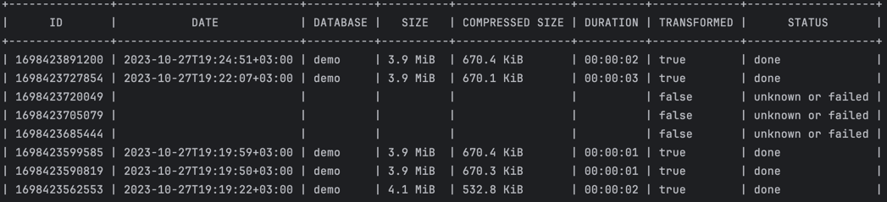

## list-dumps command

The `list-dumps` command provides a list of all dumps stored in the storage. The list includes the following attributes:

* `ID` — the unique identifier of the dump, used for operations like `restore`, `delete`, and `show-dump`
* `DATE` — the date when the snapshot was created
* `DATABASE` — the name of the database associated with the dump
* `SIZE` — the original size of the dump
* `COMPRESSED SIZE` — the size of the dump after compression
* `DURATION` — the duration of the dump procedure
* `TRANSFORMED` — indicates whether the dump has been transformed
* `STATUS` — the status of the dump, which can be one of the following:
    * `done` — the dump was completed successfully
    * `in progress` — the dump is currently being created
    * `failed` — the dump creation process failed
    * `unknown or failed` — the deprecated status of the dump that is used for failed dumps or dumps in progress for 
       version v0.1.14 and earlier
* `DESCRIPTION` — an optional user-provided note about the dump

Example of `list-dumps` output:

!!! info

    Greenmask uses a heartbeat mechanism to determine the status of a dump.
    A dump is considered `failed` if it lacks a "done" heartbeat or if the last heartbeat timestamp exceeds 30 minutes.
    Heartbeats are recorded every 15 minutes by the `dump` command while it is in progress. If `greenmask` fails unexpectedly,
    the heartbeat stops being updated, and after 30 minutes (twice the interval), the dump is classified as `failed`. 
    The `in progress` status indicates that a dump is still ongoing.

