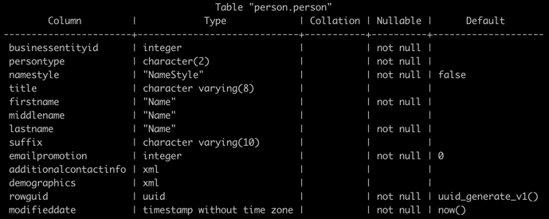

Execute a Go template and automatically apply the result to a specified column.

## Parameters

| Name     | Description                                                                                                                                                          | Default | Required | Supported DB types |
|----------|----------------------------------------------------------------------------------------------------------------------------------------------------------------------|---------|----------|--------------------|
| column   | The name of the column to be affected                                                                                                                  |         | Yes      | any                |
| template | A Go template string                                                                                                                                                 |         | Yes      | -                  |
| validate | Validates the template result using the PostgreSQL driver decoding procedure. Throws an error if a custom type does not have an encode-decoder implementation. | false   | No       | -                  |

## Description

The `Template` transformer executes Go templates and automatically applies the template result to a specified column. Go template system is designed to be extensible, enabling developers to access data objects and incorporate custom functions programmatically. For more information, you can refer to the official [Go Template documentation](https://pkg.go.dev/text/template).

With the `Template` transformer, you can implement complicated transformation logic using basic or custom template functions. Below you can get familiar with the basic template functions for the `Template` transformer. For more information about available custom template functions, see [Custom functions](custom_functions/index.md).

:::warning

Pay attention to the whitespaces in templates. Use dash-wrapped - brackets `{{- -}}` for
trimming the spaces. For example, the value `"2023-12-19"` is not the same as `" 2023-12-19  "` and it may throw an error when restoring.

:::
### Template functions

| Function               | Description                                                                                                                                                                                                                                                        | Signature                                                           |
|------------------------|--------------------------------------------------------------------------------------------------------------------------------------------------------------------------------------------------------------------------------------------------------------------|---------------------------------------------------------------------|
| `.GetColumnType`       | Returns a string with the column type.                                                                                                                                                                                                                             | `.GetColumnType(name string) (typeName string, err error)`          |
| `.GetValue`            | Returns the column value for column assigned in the `column` parameter, encoded by the PostgreSQL driver into any type along with any associated error. Supported types include `int`, `float`, `time`, `string`, `bool`, as well as `slice` or `map` of any type. | `.GetValue() (value any, err error)`                                |
| `.GetRawValue`         | Returns a raw value as a string for column assigned in the `column` parameter.                                                                                                                                                                                     | `.GetRawColumnValue(name string) (value string, err error)`         |
| `.GetColumnValue`      | Returns an encoded value for a specified column or throws an error. A value can be any of `int`, `float`, `time`, `string`, `bool`, or `slice` or `map`.                                                                                          | `.GetColumnValue(name string) (value any, err error)`               |
| `.GetRawColumnValue`   | Returns a raw value for a specified column as a string or throws an error                                                                                                                                                                                          | `.GetRawColumnValue(name string) (value string, err error)`         |
| `.EncodeValue`         | Encodes a value of any type into its string representation using the type assigned to the table column specified in the `column` parameter. Encoding is performed through the PostgreSQL driver. Throws an error if types are incompatible.                        | `.EncodeValue(value any) (res any, err error)`                      |
| `.DecodeValue`         | Decodes a value from its raw string representation to a Golang type using the data type assigned to the table column specified in the `column` parameter. Decoding is performed through the PostgreSQL driver. Throws an error if types are incompatible.          | `.DecodeValueByColumn(value any) (res any, err error)`              |
| `.EncodeValueByColumn` | Encodes a value of any type into its raw string representation using the specified column name. Encoding is performed through the PostgreSQL driver. Throws an error if types are incompatible.                                                                    | `.EncodeValueByColumn(name string, value any) (res any, err error)` |
| `.DecodeValueByColumn` | Decodes a value from its raw string representation to a Golang type using the specified column name. Decoding is performed through the PostgreSQL driver. Throws an error if types are incompatible.                                                               | `.DecodeValueByColumn(name string, value any) (res any, err error)` |
| `.EncodeValueByType`   | Encodes a value of any type into its string representation using the specified type name. Encoding is performed through the PostgreSQL driver. Throws an error if types are incompatible.                                                                          | `.EncodeValueByType(name string, value any) (res any, err error)`   |
| `.DecodeValueByType`   | Decodes a value from its raw string representation to a Golang type using the specified type name. Decoding is performed through the PostgreSQL driver. Throws an error if types are incompatible.                                                                 | `.DecodeValueByType(name string, value any) (res any, err error)`   |

## Example: Update the `firstname` column

Below you can see the table structure:



#### Change rule

The goal is to modify the `firstname` column based on the following conditions:

* If the current value of the `firstname` column is equal to `Terri`, replace it with `Mary`.
* For all other cases, generate a random name and append `Jr`.

#### Using a template function

[comment]: <> (To Do: Add a link to fakerFirstName)

To generate random names, you can use the `fakerFirstName` template function, which is designed to create
synthetic names.

```yaml title="Template transformer example"
- schema: "humanresources"
  name: "employee"
  transformation:
    - name: "Template"
      params:
        column: "firstname"
        template: >
          {{- if eq .GetValue "Terri" -}}
            Mary
          {{- else -}}
            {{- fakerFirstName -}} Jr
          {{- end -}}

        validate: true
```

Expected result:

**Value = Terry**

| column name | original value | transformed |
|-------------|----------------|-------------|
| firstname   | Terri          | Mary        |

**Value != Terri**

| column name | original value   | transformed |
|-------------|------------------|-------------|
| firstname   | Ken Jr           | Mike        |
